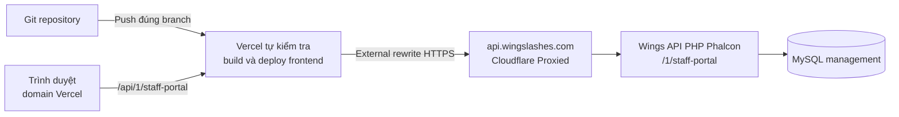

# Build, bump version và deploy — Git → Vercel, API ở Wings

**Quy trình đã được người dùng chốt: push lên Git, Vercel tự build/deploy.** Agent không chạy thêm `vercel deploy`, không SCP frontend lên Wings và không cần một pipeline CI deploy thứ hai.

Tài liệu này và `AGENTS.md` là quy trình triển khai hiện tại, thay cho phương án frontend Nginx trên Wings ban đầu. Kit được chuẩn bị để agent tích hợp vào ứng dụng mới; người dùng đã setup Vercel riêng. Agent dùng setup đó, chỉ xác minh project/remote/branch thực tế; không cấu hình lại.

## 1. Kiến trúc đã chốt



Ảnh người dùng cung cấp: DNS A `api.wingslashes.com` → origin `194.233.76.123`, Cloudflare **Proxied**, TTL Auto. Đây là dữ liệu từ ảnh; chưa kiểm tra DNS/server live. Khi kết nối thật, dùng **domain HTTPS**, không dùng IP làm API URL. Record này phục vụ backend Wings, không trỏ sang Vercel.

Frontend chạy ở root `https://<project>.vercel.app/`, Vite `base: '/'`. Tên domain thật và branch production phải đọc từ Vercel project/Git integration đã kết nối; không tự đoán `main` hay tên project.

Ví dụ gọi API:

```text
Browser: https://<project>.vercel.app/api/1/staff-portal/auth/me
    ↓ Vercel rewrite, URL browser giữ nguyên
Upstream: https://api.wingslashes.com/1/staff-portal/auth/me
```

Backend, auth và dữ liệu vẫn ở Wings. Rewrite chỉ chuyển tiếp request. Đây là chức năng external rewrite của [Vercel](https://vercel.com/docs/routing/rewrites).

## 2. Thiết lập một lần cho repo frontend

Agent thực hiện khi dựng app mới:

1. Tạo/chọn đúng Git repo frontend, kiểm tra remote và project đã liên kết. Chỉ đưa source frontend và kit cần thiết vào repo đó; code backend nằm trong repo Wings riêng.
2. Copy `AGENTS.md`, tài liệu hướng dẫn, `release-kit/release.policy.json` và thư mục `release-kit/scripts/` vào root repo. Hợp nhất nội dung `gitignore.fragment` vào `.gitignore`.
3. Hợp nhất `package-scripts.example.json` vào `package.json.scripts`. Đây là fragment, không thay toàn bộ `package.json`.
4. Giữ lệnh Vite gốc ở `build:app` (ví dụ `vite build`). Script `build` chạy verify rồi build-release; build-release chỉ gọi `build:app`, không gọi ngược `build`. Hợp nhất package scripts theo setup app hiện có, không thay build settings trên Vercel.
5. Đặt `package.json.name = wings-staff-portal`; version đầu ví dụ `0.1.0`; tạo và commit `package-lock.json` bằng npm đã chọn. Nếu đổi tên app, sửa đồng bộ policy và guard trong scripts.
6. Định nghĩa `verify` chạy các kiểm tra có thật của app: lint/typecheck nếu áp dụng và test logic/contract auth-role-store. Test tích hợp có ghi dữ liệu dùng staging riêng. Không để script placeholder luôn thành công. Backend PHP có bộ kiểm tra riêng trong repo Wings.
7. Chọn Node major đang được Vercel hỗ trợ, khai báo `engines.node`, pin phiên bản local đã thử trong `.node-version`; ghi Node version thực tế vào release. Vercel quản lý patch runtime của họ, không mặc định buộc patch Vercel bằng patch trên máy dev.
8. Vite dùng `base: '/'`, route giao diện `/`, `/login`, `/pending`, `/app/*`; đối chiếu routing hiện có để reload những route này hoạt động. Không tự chỉnh Vercel; nếu thiếu rule cần thiết thì ghi rõ phần tích hợp chưa có. Giữ API và asset ngoài fallback HTML.

Để hiển thị phiên bản trong giao diện:

```js
const appVersion = import.meta.env.VITE_APP_VERSION || 'dev';
const buildSha = (import.meta.env.VITE_BUILD_SHA || '').slice(0, 12);
// Trang Thông tin/Cài đặt: v{appVersion} · {buildSha}
```

`build-release.mjs` tự truyền các biến trên. Không hardcode `v0.1.0` trong component. Không commit `dist/`, `.vercel/`, secret hoặc file `.env` riêng.

## 3. Vercel người dùng đã setup — giữ nguyên

**Không cần cấu hình Vercel trong nhiệm vụ này.** Không tạo/link project, không sửa domain, production branch, build settings, biến môi trường hay DNS. Không có file cấu hình Vercel tự áp dụng trong gói bàn giao.

Khi agent làm ứng dụng, đọc project/Git integration đang có để biết đúng repo, root directory, branch production và domain. Push vào branch được giao để Vercel tự build/deploy. Không chạy thêm `vercel deploy`, deploy hook hoặc CI deploy trùng. [Vercel Git integration](https://vercel.com/docs/git).

Kit cung cấp package scripts để tích hợp **trong source app**: nếu setup hiện tại chạy `npm run build`, script đó sẽ chạy verify + build có version metadata. Không tự sửa settings trên Dashboard. Nếu build command hiện tại khác, đối chiếu trước và ghi lại phần cần nối.

Browser API base đề xuất `/api/1/staff-portal`, upstream production `https://api.wingslashes.com/1/staff-portal`. Routing/cookie phải được kiểm tra qua setup có sẵn. Không khẳng định rewrite đã tồn tại chỉ vì tài liệu dùng nó.

Preview/staging khi cần dùng dữ liệu tách riêng. Script check-backend đọc `WINGS_API_UPSTREAM` từ shell khi được chạy riêng; chưa yêu cầu thêm biến môi trường Vercel. Script không nằm trong build mặc định và không tự sửa environment. Metadata build ưu tiên Git SHA Vercel, có thể đọc HEAD của checkout nếu không có biến hệ thống.

## 4. Backend phải có trước khi build frontend

Ngoài API nghiệp vụ trong `HUONG_DAN.md`, module Wings cần endpoint health chỉ đọc:

```http
GET /1/staff-portal/health
```

```json
{
  "status": "success",
  "code": "0000",
  "message": "",
  "data": {
    "app": "wings-staff-portal",
    "api_contract": "1",
    "schema_version": 1
  }
}
```

`schema_version` đọc từ lịch sử migration/kiểm tra schema **đã áp dụng**, không khai báo thành công theo file SQL chưa chạy. Nếu schema chưa đúng hoặc không kiểm tra được, trả lỗi readiness/503. `api_contract` là hợp đồng API app mới; không phải số `/1` trong URL Wings. Health không trả DSN, hostname nội bộ, user list hoặc credentials.

`GET /auth/me` khi không có session phải trả HTTP 401 và JSON `status: error`. `check-backend.mjs` gọi đúng hai endpoint này, không gửi OTP, không ghi DB và không tự chạy migration. Chạy kiểm tra này riêng trước release cần API mới; nếu lỗi thì sửa backend/routing trước khi phát hành frontend phụ thuộc vào API đó. Build frontend mặc định không gọi backend.

Bảng lịch sử migration: sử dụng cơ chế migration có sẵn nếu phù hợp; nếu chưa có, backend tạo bảng metadata riêng qua CLI migration runner với version, checksum, applied_at. Bốn bảng core trong SQL bàn giao chưa bao gồm runner/bảng metadata này. Runner khóa chạy đồng thời, ghi phiên bản sau khi DDL đã được xác nhận; không giả định DDL toàn bộ file rollback được.

## 5. Cookie, Origin, Cloudflare

Backend portal phát cookie để dùng qua rewrite:

```http
Set-Cookie: wings_portal_session=<opaque-token>; Path=/api/1/staff-portal/; HttpOnly; Secure; SameSite=Lax
Cache-Control: private, no-store
```

- Không đặt Domain Wings trên cookie này. Qua proxy, browser nhận nó từ domain Vercel của app. Verify POST phải giữ `Set-Cookie`; request sau phải gửi lại cookie qua proxy đúng path.
- Browser dùng `credentials: 'same-origin'`. Cookie PHP/Admin trên `wingslashes.com` không tự chia sẻ sang `vercel.app`; portal vẫn xác minh Wings và cấp phiên riêng.
- Backend allowlist chính xác Origin production và preview được cho phép. Preview URL mới cần đăng ký sau khi đã xác minh thuộc đúng project; không allow tất cả `*.vercel.app`. GET có thể không có Origin; thao tác ghi phải kiểm tra Origin và CSRF như thiết kế.
- Vercel rewrite không cần browser CORS giữa hai domain vì browser gọi cùng origin. Nếu sau này chuyển sang gọi trực tiếp domain API, cần thiết kế CORS/credentials riêng và kiểm tra giới hạn cookie bên thứ ba; không chỉ đổi base URL rồi giả định login còn hoạt động.
- Cloudflare phải cho route portal trả JSON, giữ cookie/header và không cache API riêng tư. Nếu gặp 403/challenge HTML, 502 hoặc 520, đọc response/log và chỉnh rule hẹp cho API theo chính sách hiện có; không tắt proxy/WAF toàn domain.
- Xác minh HTTPS từ Vercel đến Cloudflare và từ Cloudflare tới origin theo cấu hình TLS của Wings. Kiểm tra thực tế trên staging; ảnh DNS không chứng minh TLS hay API route đã hoạt động.

## 6. Quy trình cho mỗi lần phát hành

1. **Xác định phạm vi:** source frontend/backend, Git remote, branch và Vercel project đúng; ghi bản live hiện tại để rollback.
2. **Làm code và kiểm tra:** local lint/test; test API và phân quyền trên môi trường phù hợp. Hoàn thiện changelog.
3. **Backend thay đổi thì làm trước:** triển khai migration additive và API tương thích cả frontend cũ lẫn mới trên Wings. Kiểm tra health/schema. Nếu chỉ thay UI thì dùng API hiện tại đã tương thích.
4. **Bump version một lần cho release:** patch sửa lỗi, minor thêm tính năng tương thích, major thay contract. Version đầu `0.1.0` có thể giữ nguyên. Không bump trong Vercel build.
5. **Commit đúng file:** cả package và lockfile, changelog, source/config thay đổi. Không commit file build hay thay đổi ngoài phạm vi.
6. **Push branch đã xác định:** Vercel tự lấy commit, install, verify, check backend, build và deploy. Feature branch thường ra Preview; production branch ra Production theo cài đặt thật.
7. **Đợi kết quả deployment:** kiểm tra đúng commit/branch/project và trạng thái Ready; nếu Error thì đọc log, sửa và push lại. Không chạy thêm CLI deploy.
8. **Kiểm tra bản được phục vụ:** version/commit, assets, API qua rewrite, login/pending/role/store/logout trong browser. Kiểm tra cả deployment URL và domain production sau khi domain được gán.
9. **Báo cáo:** version, commit, deployment URL/ID, backend release/migrations, kết quả test và rollback.

Ví dụ lệnh trong repo mới, agent thay danh sách file và branch theo thực tế:

```bash
npm ci
npm run verify
npm run release:bump -- patch
git diff -- package.json package-lock.json CHANGELOG.md
git add package.json package-lock.json CHANGELOG.md
# Stage thêm đúng những file source/config đã review.
git diff --cached
git commit -m "release: v0.1.1"
# Push đúng branch đã xác định; <branch> là placeholder.
git push origin HEAD:<branch>
```

Changelog phải được chỉnh trước commit; script bump chỉ sửa version. `npm version --no-git-tag-version` cập nhật package/lockfile và không tự tạo commit/tag; kit tắt lifecycle hooks cho bước này. [npm version](https://docs.npmjs.com/cli/v11/commands/npm-version/).

Không cần build local để upload. Muốn kiểm tra build local trước push có thể chạy `npm run build` sau commit; output này chỉ dùng kiểm tra, Vercel vẫn tự build từ Git. Script build local yêu cầu Git sạch và `dist/` đã được ignore. [Vercel Git deployments](https://vercel.com/docs/git).

## 7. Kiểm tra sau khi Vercel Ready

Chạy từ checkout của release, thay domain/version/full SHA bằng giá trị thật:

```bash
npm run release:verify -- https://<project>.vercel.app 0.1.1 <full-git-sha>
```

Script chỉ đọc và kiểm tra:

- `version.json` đúng app, version, commit và release policy.
- `release-manifest.json` khớp metadata; từng file public có SHA-256 đúng manifest của chính deployment đó.
- `/api/1/staff-portal/health` qua Vercel khớp contract/schema.
- `/api/1/staff-portal/auth/me` không session trả 401 JSON.

Manifest là bằng chứng nhất quán build/serve, không phải chữ ký chống kẻ tấn công sửa đồng thời manifest và asset. Vercel deployment ID/commit trong control plane vẫn cần đối chiếu.

Script không tự bypass Deployment Protection. Với preview được bảo vệ, dùng luồng truy cập Vercel/browser đã xác thực và chạy các kiểm tra tương đương; không tắt protection hoặc đưa bypass token vào URL/log. Không báo các check chưa chạy là đã pass.

Browser test bắt buộc cho phiên đăng nhập: verify OTP → có cookie host-only trên domain Vercel → `/auth/me` đúng người → thử chi nhánh khác bị chặn → logout làm phiên cũ mất hiệu lực. Kiểm tra 2 tài khoản để phát hiện cache nhầm dữ liệu. Bộ release script không thay các test nghiệp vụ này.

## 8. Backend deployment Wings khi có thay đổi

Đây là quy trình cho agent làm backend, không tự chạy từ Vercel build:

1. Đọc release/symlink thực tế của Wings, hash các file sắp sửa; dùng đúng runtime PHP-FPM. Không suy ra live source từ một thư mục backup cũ.
2. Tạo patch chỉ gồm module portal và những thay đổi middleware/include/log thực sự cần. Ghi allowlist file, hash nền, commit backend và migration checksum.
3. Dùng khóa deploy chung hiện có của Wings; lấy release đang chạy làm nền. Không tạo cơ chế khóa riêng mà các deploy Wings khác không tuân thủ rồi coi đã tránh được race.
4. Áp patch vào release mới, giữ file/config ngoài phạm vi. Chạy `php -l`, kiểm thử guard/routing/JSON, auth/role/store và regression API cũ; không dùng số dòng làm bằng chứng file đúng.
5. Chạy migration qua CLI với kết nối server được cấu hình; xác nhận schema và history. Không gọi endpoint HTTP migrate public.
6. Kiểm tra lại release/hash nền ngay trước switch. Nếu đã đổi, dừng switch và đồng bộ patch với release mới.
7. Switch release qua quy trình hiện có, reload PHP-FPM khi cần, kiểm tra health và API. Lưu cách trả về release trước.
8. Khi backend đạt contract/schema frontend yêu cầu mới push release frontend cần API đó.

Ứng dụng người dùng khác có thể đang chạy trong cùng backend. Patch portal phải tương thích với hệ thống hiện có và không đổi quyền của Checkout/Ctrl.

## 9. Rollback và version khi có lỗi

- **Build Vercel lỗi:** bản production trước thường vẫn được phục vụ; xác minh trên dashboard/domain. Sửa lỗi và push commit mới; không gọi deploy thứ hai ngoài Git integration.
- **Bản Ready nhưng lỗi nghiệp vụ:** trả frontend về deployment tốt đã biết bằng tính năng rollback của Vercel khi nằm trong phạm vi xử lý release. Ghi lại deployment ID; kiểm tra tương thích backend trước rollback.
- **Git phải khớp trạng thái mong muốn:** revert đúng commit lỗi hoặc sửa forward trên branch phát hành, bump patch mới rồi push. Không force-push để xóa lịch sử, không tái dùng một version đã phát hành cho nội dung khác.
- **Sau instant rollback:** kiểm tra cài đặt auto-assignment của production domain vì rollback Vercel có thể tạm ngắt việc gán domain cho các push sau; khôi phục đúng chế độ Git auto deploy sau khi xử lý lỗi, rồi xác nhận push tiếp theo thực sự được phục vụ. [Vercel rollback](https://vercel.com/docs/deployments/rollback).
- **Backend/DB:** chỉ rollback code về release tương thích; giữ migration additive và dữ liệu mới. Thay đổi schema phá vỡ tương thích cần kế hoạch riêng trước khi release, không tự DROP bảng khi rollback frontend.

## 10. Mẫu biên bản release

```text
Ứng dụng: Wings Staff Portal
Version:
Git remote/branch:
Frontend commit:
Vercel team/project:
Environment: Preview / Production
Deployment URL/ID:
Domain đang phục vụ:
Backend Wings release/commit:
API contract / schema version:
Migration và checksum đã áp dụng:
Kết quả build / version / file hash / API:
Kết quả browser auth / role / store / logout:
Kiểm tra chưa chạy và lý do:
Deployment/release trước để rollback:
```

**Trạng thái của bộ kit khi bàn giao:** chỉ file local; không tạo repo, push Git, thay DNS/Cloudflare, cấu hình Vercel hoặc deploy Wings. Vercel do người dùng đã setup được giữ nguyên. Agent triển khai sẽ dùng quy trình trên khi app và đích thực tế đã được xác định.
