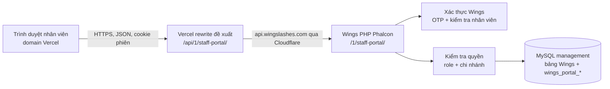
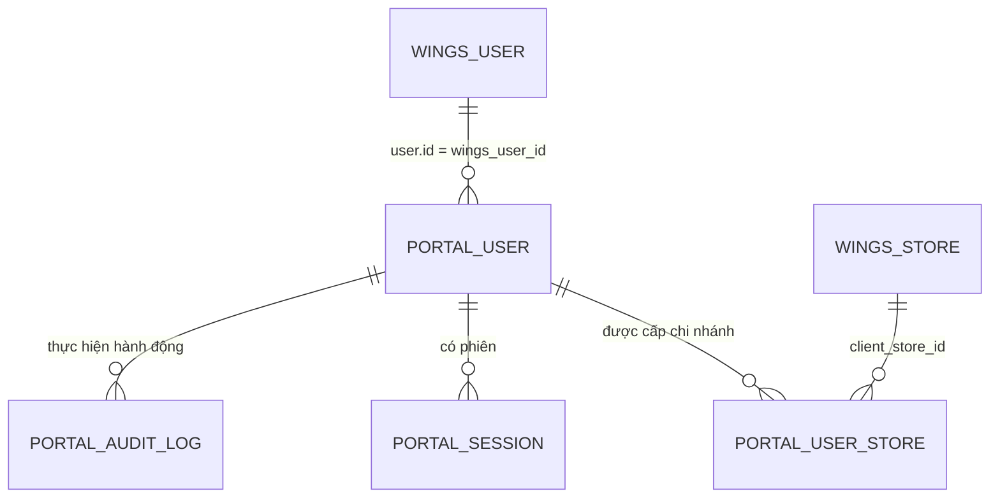

# Hướng dẫn tạo website nhân viên theo cấu trúc Wings Checkout / Wings Ctrl

Ngày đối chiếu source: **07/10/2026**. Tên minh họa cho website mới: **Wings Staff Portal**, frontend tại root domain Vercel do người dùng đã setup.

**Kiến trúc đã chốt:** frontend lưu Git, dùng Vercel người dùng đã setup; push Git để Vercel tự build/deploy. Backend PHP và MySQL `management` ở Wings; API qua `https://api.wingslashes.com`. Xác thực bằng tài khoản nhân viên Wings, quyền app ở `wings_portal_*`. Không tự thay cấu hình Vercel/DNS. Đọc thêm `AGENTS.md` và `BUILD_VERSION_DEPLOY.md` trong bộ bàn giao.

Bạn đã đồng ý hướng dùng OTP và phân quyền theo chi nhánh. Chức năng nghiệp vụ sau đăng nhập chưa được xác định; phần nền tảng bên dưới dùng được cho website thông báo, báo cáo, yêu cầu nội bộ hoặc công cụ khác. Ví dụ “gửi yêu cầu” chỉ để minh họa luồng lưu dữ liệu.

Đây là tài liệu thiết kế dựa trên **source local**, kèm SQL mẫu. Chưa kết nối kiểm tra schema production, chạy migration, gọi OTP hay triển khai website. Một số bản sao source khác nhau; các điểm cần kiểm tra trước triển khai được ghi tại bước liên quan.

## 1. Hai ứng dụng hiện có thực sự tổ chức như thế nào?

| Thành phần | Wings Checkout | Wings Ctrl |
|---|---|---|
| Frontend | HTML/CSS/JavaScript thuần, có service worker | React 19 + Vite 6; desktop và mobile |
| Source chính | `wings-dashboard/Server/src/frontend/shop-checkout/` | `wings-ctrl/src/` |
| Đường dẫn website | `/shop-checkout/` | `/control/` |
| API module | `app/cc-feedback.php` | `wings-ctrl/wingsctrl.php`, được deploy vào `app/wingsctrl.php` |
| API prefix | `/1/cc-feedback/*` trên API host | Frontend gọi `/api/1/wingsctrl/*`, Nginx proxy sang API host `/1/wingsctrl/*` |
| Framework backend | PHP Phalcon Micro dùng `$app->post(...)` / `$app->get(...)` | Cùng cách tổ chức |
| Database | MySQL `management` qua `$app->db` | Cùng database và connection |
| User nội bộ | Dùng `wingsctrl_users`; một số bảng dữ liệu `cc_feedback_*` | Dùng `wingsctrl_users`, role `owner/editor/viewer` |
| Dữ liệu riêng | Feedback, ghi chú tư vấn, payment logs… | Lịch, roster, touchpoint, activity, presence… |

**Wings Checkout và Wings Ctrl không có luồng đăng nhập giống hệt nhau trong source đã đọc:**

- Checkout: frontend `login()` gửi `phone_number` và `name` tới `cc-feedback/auth/login`, lưu user dưới key `ccFeedbackUser`. Backend bản local có `ccFeedbackRequireAdminSession()`, yêu cầu phiên Wings Admin trước khi thực hiện route. Hai đoạn này cho thấy cần kiểm tra lại cơ chế truyền phiên của bản đang chạy nếu tích hợp trực tiếp Checkout.
- Ctrl mới: frontend gửi OTP, xác minh qua `/public/user/contact/verify`, rồi gọi `/wingsctrl/auth/login-otp` để lấy/tạo user ứng dụng. Tài khoản mới có `viewer`, `is_approved = 0` và UI chờ duyệt.
- Ctrl còn tài liệu và endpoint Google/PIN cũ. Không dùng tài liệu Google login làm mô tả luồng mặc định hiện tại.
- Ctrl dùng cột `phone`; Checkout có logic thêm và dùng `phone_number` trong cùng `wingsctrl_users`. Cần kiểm tra schema thật trước khi chạm bảng này.
- `wingsctrl_sessions` hiện mô tả ai đang online/xem lịch nào; nó không phải bảng token đăng nhập có thời hạn và thu hồi như bảng session được đề xuất ở đây.

**Nên kế thừa:** cách tách frontend/module API, database dùng chung, prefix bảng theo ứng dụng, phân quyền và giới hạn chi nhánh.

**Cần làm đầy đủ cho app mới:** backend xác minh danh tính, kiểm tra quyền ở từng request, quản lý phiên có thời hạn. Trong `wings-ctrl/wingsctrl.php`, handler `auth/login-otp` đọc phone/name/avatar nhưng không sử dụng các trường token mà frontend gửi để chứng minh danh tính trong chính handler đó. Không dùng handler này nguyên trạng làm cổng xác thực cho website mới.

## 2. Kiến trúc cho website mới



Các giá trị tên mới bên dưới là **đề xuất**, chưa phải endpoint đang tồn tại:

| Mục | Giá trị đề xuất |
|---|---|
| Source frontend | `WingsOBS/wings-staff-portal/` |
| URL frontend | Domain Vercel người dùng đã cấu hình, app ở `/` |
| Hosting frontend | Vercel Git integration đã có, không upload lên Wings |
| API public mà trình duyệt gọi | `/api/1/staff-portal/*` |
| API upstream | `https://api.wingslashes.com/1/staff-portal/*` |
| File đăng ký route | `Server/src/api/1/app/staff-portal.php` trong backend Wings |
| Database | `management`, lấy từ config backend hiện có |
| Prefix bảng riêng | `wings_portal_` |

Frontend chỉ nhận JSON qua API. DB host, tài khoản DB và mật khẩu nằm ở backend. `app/config/services.php` đã tạo `$app->db` bằng cấu hình môi trường; module mới sử dụng connection này.

## 3. Dùng lại dữ liệu nào, tạo thêm bảng nào?

### Dữ liệu Wings đã có

| Bảng / model | Vai trò trong website mới |
|---|---|
| `user` / `User` | Danh tính gốc; `user.id` là khóa nhân viên dùng để liên kết |
| `user_profile` / `UserProfile` | Hồ sơ theo business, tên, nhóm, trạng thái đang làm/khóa/nghỉ việc |
| `user_contact` / `UserContact` | Điện thoại đã gắn với user |
| `user_group` / `UserGroup` | Phân biệt nhóm khách hàng và nhóm nhân viên |
| `client_store` + dữ liệu tên tương ứng | Chi nhánh, business sở hữu chi nhánh |
| `ClientStore::getByItemClient($wingsUserId)` | Lấy chi nhánh nhân viên có quyền trong Wings, dựa trên quan hệ ItemClient |
| `user_access_token` / `UserAccessToken` | Token Wings hiện có nếu cần hỗ trợ trao đổi phiên |
| `UserVerificationCode` | Cơ chế mã xác minh hiện có, dùng qua service xác thực |

Không tạo lại toàn bộ danh bạ nhân viên. App mới lưu quan hệ tới `user.id`. Đừng nhầm `user.id` với `wingsctrl_users.id`: đây là **hai loại ID khác nhau**. Cũng không dùng số điện thoại làm khóa liên kết lâu dài vì số điện thoại có thể thay đổi.

### Bốn bảng nền tảng cần thêm

| Bảng | Dùng làm gì? | Ví dụ |
|---|---|---|
| `wings_portal_users` | Quyền tham gia app: Wings user nào, thuộc business nào, role, trạng thái duyệt | Nhân viên A được duyệt làm `editor` |
| `wings_portal_user_stores` | Danh sách chi nhánh được cấp trong app | Nhân viên A được xem chi nhánh 6 và 16 |
| `wings_portal_sessions` | Phiên đăng nhập thực sự: hash token, thời hạn, thu hồi | Logout làm token cũ mất hiệu lực |
| `wings_portal_audit_log` | Ghi ai thực hiện thay đổi gì | Owner duyệt A; A cập nhật một bản ghi |

`display_name` và `avatar_url` chỉ là thông tin hiển thị được đồng bộ từ Wings. Quyền, trạng thái nhân viên và chi nhánh phải lấy từ server.

**Vì sao không thêm tất cả vào `wingsctrl_users`?** Bảng này đã phục vụ Ctrl và Checkout, có khác biệt cột và quy tắc duyệt. Quyền dùng website mới có thể khác quyền dùng Ctrl. Bảng riêng giúp owner cấp quyền cho app mới mà không làm người đó trở thành owner của Ctrl.



Đây là quan hệ logic. File SQL chỉ tạo foreign key giữa các bảng mới; chưa tạo FK sang legacy vì chưa kiểm tra kiểu cột và engine thực tế.

## 4. Chuẩn bị database và chạy migration

SQL đầy đủ: [001_wings_portal_core.sql](001_wings_portal_core.sql).

Trước tiên, chạy các câu **chỉ đọc** trên local/staging để xác nhận môi trường:

```sql
SELECT DATABASE(), VERSION(), @@session.time_zone;
SHOW CREATE TABLE `user`;
SHOW CREATE TABLE `user_profile`;
SHOW CREATE TABLE `client_store`;
SHOW CREATE TABLE `user_access_token`;
SHOW CREATE TABLE `wingsctrl_users`;
SHOW TABLES LIKE 'wings_portal_%';
```

Kiểm tra:

1. Đang chọn đúng database; bản local dùng schema `management` trong các model đã đọc.
2. ID legacy là kiểu gì, có signed/unsigned không, engine có phải InnoDB không.
3. Bảng mới chưa tồn tại. Nếu đã tồn tại, so sánh schema và viết migration bổ sung; không chạy lại bản tạo đầu.
4. Connection của module mới dùng `utf8mb4` và múi giờ đã thống nhất.

Quy ước đề xuất: mọi `DATETIME` của **bảng mới** lưu UTC, ghi bằng `UTC_TIMESTAMP()`, trả API dạng ISO 8601 UTC, frontend hiển thị `Asia/Ho_Chi_Minh`. Các bảng Wings cũ dùng thời gian theo quy ước hiện có; khi kiểm tra hạn token/OTP legacy, dùng cùng quy ước của legacy. Không tự đổi timezone toàn connection chung vì có thể làm lệch truy vấn hệ thống cũ.

Ví dụ chạy bằng tài khoản migration trên database thử nghiệm, thay các placeholder:

```bash
mysql --host=DB_HOST --user=MIGRATION_USER --password DB_NAME \
  < /Users/kennguyen/Desktop/WingsOBS/outputs/staff-portal-guide-2026-10-07/001_wings_portal_core.sql
```

CLI sẽ hỏi mật khẩu; không đưa mật khẩu vào frontend hoặc câu lệnh. File này không tự tạo owner và không sửa bảng cũ. Lưu tên migration đã chạy trong công cụ/quy trình migration của dự án. DDL MySQL có thể implicit commit, nên không coi `ROLLBACK` là cách hoàn tác chắc chắn cho cả file.

Nếu có tính năng riêng, tạo migration tiếp theo, ví dụ `002_wings_portal_requests.sql`. Không tạo bảng nghiệp vụ dựa trên phỏng đoán rồi đưa vào production.

## 5. Luồng đăng nhập đề xuất

**Một lần chứng minh danh tính Wings → một phiên riêng của website mới.** Người dùng vẫn nhập SĐT và OTP như Ctrl; phần xác thực được backend thực hiện.

```mermaid
sequenceDiagram
    actor U as Nhân viên
    participant F as Frontend
    participant P as Portal API
    participant W as Wings Auth
    participant D as Database
    U->>F: Nhập số điện thoại
    F->>P: POST /auth/otp/request
    P->>D: Kiểm tra nhân viên, business, trạng thái
    P->>W: Gửi OTP theo giới hạn gửi
    P-->>F: Đã tiếp nhận, thời gian được gửi lại
    U->>F: Nhập OTP
    F->>P: POST /auth/otp/verify
    P->>W: Xác minh mã, hạn dùng và chống dùng lại
    W-->>P: Danh tính Wings đã xác minh
    P->>D: Lấy/tạo portal user; đọc role và trạng thái
    P->>D: Tạo session nếu đủ điều kiện
    P-->>F: Set-Cookie + user + quyền + CSRF token
    F-->>U: Chờ duyệt hoặc vào ứng dụng
```

### Bước 1 — Nhập điện thoại, yêu cầu mã

Frontend gọi endpoint mới:

```http
POST /api/1/staff-portal/auth/otp/request
Content-Type: application/json

{"phone_number":"<SĐT nhân viên>"}
```

Backend chuẩn hóa số bằng cùng logic phone của Wings, tìm đúng `user_contact`, rồi kiểm tra `user_profile` thuộc business cấu hình. Loại tài khoản khách hàng; kiểm tra `is_disabled`, `is_deleted`, `is_leaved` và chính sách `is_temporary`. Nhóm nhân viên phải được xác định theo `user_group_key`/chính sách Wings đã kiểm tra, không coi mọi user có OTP là nhân viên.

Sau đó gửi OTP bằng service Wings. Có giới hạn gửi theo IP và số điện thoại, giới hạn số lần nhập sai, và khoảng chờ gửi lại. Giá trị cụ thể cần theo chính sách SMS hiện có; cooldown trên UI chỉ để hiển thị, server mới là nơi áp dụng giới hạn.

Source hiện tại có endpoint `POST /1/public/user/contact/register`, nhận `phone_number` và các metadata như `client_business_id`, `language_code`, `device_platform`, `device_os`, `app_version`. Với module mới, các metadata cần tin cậy như business được cấu hình ở backend, không lấy nguyên từ browser.

### Bước 2 — Xác minh OTP ở backend

```http
POST /api/1/staff-portal/auth/otp/verify
Content-Type: application/json

{"phone_number":"<SĐT nhân viên>","verification_code":"<OTP vừa nhận>"}
```

Backend xác minh mã, lấy `wings_user_id` từ kết quả đã xác minh và tra lại hồ sơ nhân viên. Không nhận `role`, `is_approved`, `wings_user_id` hay avatar từ client làm căn cứ quyền.

**Điểm cần xử lý khi tái sử dụng auth Wings:** source `/public/user/contact/verify` hiện có nhánh passcode và nhánh hỗ trợ môi trường local bên cạnh OTP; không thể chỉ đổi tên endpoint rồi khẳng định luồng mới là OTP nghiêm ngặt. Khi triển khai, tách/tái sử dụng service xác minh với chế độ OTP cho portal, chỉ chấp nhận mã còn hạn, chưa dùng, có giới hạn thử. Việc đánh dấu mã đã dùng phải bảo đảm chỉ một request thành công, kể cả hai request đồng thời. Nếu tổ chức muốn giữ passcode như một cách đăng nhập riêng, cần mô tả đúng trong yêu cầu sản phẩm.

Adapter phải đọc đúng response của bản API được chọn. Source local `public.php` trả profile và token trong `data.user`; service Ctrl có xử lý cả biến thể token ở `data`. Khi tích hợp, kiểm tra response thực tế trên staging, xác nhận `status`, `code` và các trường danh tính bắt buộc. Thiếu danh tính hoặc lỗi API thì dừng đăng nhập, không fallback bằng số điện thoại client gửi.

### Bước 3 — Tạo hoặc lấy quyền của app

Tìm `wings_portal_users` bằng `(client_business_id, wings_user_id)`:

- Chưa có: tạo `role = viewer`, `status = pending`; chưa cấp chi nhánh.
- `pending`: cấp phiên chỉ dùng được `/auth/me` và `/auth/logout`; UI hiển thị chờ duyệt.
- `active`: trả quyền và các chi nhánh được phép.
- `disabled`: từ chối đăng nhập và thu hồi phiên cũ nếu có.

Unique key trong SQL ngăn tạo trùng khi đăng nhập đồng thời. Service nên xử lý duplicate insert bằng cách đọc lại bản ghi, không đặt lại role/status của user đã tồn tại. Name/avatar cập nhật từ hồ sơ Wings.

### Bước 4 — Tạo phiên website

Ví dụ tạo hai giá trị ngẫu nhiên ở PHP:

```php
$rawToken = bin2hex(random_bytes(32));
$tokenHash = hash('sha256', $rawToken);
$csrfToken = bin2hex(random_bytes(32));
```

Lưu `$tokenHash` vào `wings_portal_sessions`; chỉ gửi raw token bằng cookie. `random_bytes()` tạo dữ liệu ngẫu nhiên phù hợp cho mục đích mật mã. [PHP manual](https://www.php.net/manual/en/function.random-bytes.php).

Cookie production đề xuất:

```http
Set-Cookie: wings_portal_session=<raw-token>; Path=/api/1/staff-portal/; HttpOnly; Secure; SameSite=Lax
Cache-Control: no-store
```

Không đặt `Domain` để cookie thuộc host trả response cho browser. Với phương án Vercel rewrite, browser nhận response từ domain Vercel, vì vậy đường dẫn cookie là đường dẫn public `/api/1/staff-portal/`, không phải path upstream `/1/...`. Cookie Path giúp giới hạn nơi browser gửi cookie; các app cùng origin vẫn cần được tin cậy, Path không tạo một vùng bảo mật độc lập.

Mặc định đề xuất để bắt đầu: hết phiên sau **12 giờ**, hết phiên khi không hoạt động **60 phút**, phiên chờ duyệt tối đa **30 phút**. Đây là lựa chọn thiết kế có thể chỉnh, không phải hạn phiên đã xác nhận của Wings. Server kiểm tra cả `expires_at`, `last_seen_at` và `revoked_at`; cookie mất hay còn không thay thế kiểm tra này.

Response trả `csrf_token`; frontend giữ trong memory và gửi `X-CSRF-Token` cho request thay đổi dữ liệu. Server so sánh với token của session bằng so sánh constant-time, đồng thời kiểm tra Origin đúng danh sách cho phép. Các route request/verify OTP chưa có phiên cũng cần kiểm tra Origin/JSON và giới hạn request để tránh login CSRF/lạm dụng gửi mã. Cookie flags và kiểm tra CSRF là hai phần bổ sung cho nhau. [OWASP Session Management](https://cheatsheetseries.owasp.org/cheatsheets/Session_Management_Cheat_Sheet.html), [OWASP CSRF Prevention](https://cheatsheetseries.owasp.org/cheatsheets/Cross-Site_Request_Forgery_Prevention_Cheat_Sheet.html).

### Bước 5 — Mở lại trang và logout

- Khi mở/reload: gọi `GET /auth/me`; chỉ render dữ liệu nghiệp vụ sau khi server trả user `active`.
- `/auth/me` trả thông tin mới, chi nhánh và CSRF token; không lấy quyền từ localStorage.
- Logout: `POST /auth/logout`, server ghi `revoked_at`, xóa cookie bằng cùng Path rồi UI về login.
- Khi khóa user hoặc thu hồi quyền: cập nhật DB; lần gọi API tiếp theo phải đọc quyền mới. Không giữ quyền cũ đến hết thời hạn cookie.

Nếu muốn đăng nhập từ phiên Wings Admin đã có, có thể thêm `/auth/exchange` sau. Endpoint đó phải xác minh `user_id + login_token`, hạn token và trạng thái nhân viên ở backend trước khi tạo phiên portal. `UserAccessToken::getByToken()` trong source local chỉ lọc user và token, chưa lọc `date_expired`; cần kiểm tra hạn riêng. Không coi `session_id`, localStorage `currentUser` hay user object là bằng chứng xác thực.

## 6. Thiết kế quyền và chi nhánh

| Hành động | Viewer | Editor | Owner |
|---|---:|---:|---:|
| Xem dữ liệu thuộc chi nhánh được cấp | Có | Có | Có |
| Tạo/cập nhật dữ liệu nghiệp vụ | Không | Có | Có |
| Duyệt user, đổi role, khóa user | Không | Không | Có |
| Gán quyền chi nhánh cho user | Không | Không | Có |
| Xem audit log | Không | Theo yêu cầu nghiệp vụ | Có |

Đây là bộ quyền khởi đầu giống Ctrl. Nếu mọi nhân viên phải gửi báo cáo/yêu cầu, thêm permission phù hợp hoặc role `staff`; đừng vô tình cấp toàn bộ quyền editor chỉ để cho phép gửi một form.

Role chỉ quyết định **được làm gì**. Phạm vi store quyết định **được làm ở đâu**. Mặc định owner cũng tuân theo store scope; quyền quản trị user nằm trong business của app và không đồng nghĩa tự động được xem tất cả dữ liệu cửa hàng.

Phạm vi cuối cùng:

```text
Chi nhánh được dùng =
  chi nhánh cấp trong wings_portal_user_stores
  ∩ chi nhánh nhân viên còn quyền trong Wings
  ∩ chi nhánh đang hoạt động và thuộc đúng business
```

Với nhân sự có quyền toàn business, phải có một quy tắc xác định quyền đó ở server; không diễn giải danh sách rỗng thành “toàn bộ chi nhánh”. Nếu dữ liệu Wings thiếu quan hệ store, sửa quyền Wings hoặc đưa ra mapping quản trị rõ ràng trước khi cho dùng.

API dùng `client_store_id`, không dùng chuỗi `De Tham`/`Estella` làm khóa. Tên lấy từ danh mục để hiển thị. Tài liệu Ctrl có mapping 6/2/16 cho một số chi nhánh; đó là tham chiếu source, cần xác nhận từ DB trước dùng.

Frontend có thể ẩn nút theo permission để tiện sử dụng. Backend vẫn kiểm tra mỗi request, kể cả khi gọi trực tiếp không qua giao diện. [OWASP Authorization](https://cheatsheetseries.owasp.org/cheatsheets/Authorization_Cheat_Sheet.html).

## 7. Danh sách API cần làm

Prefix public cho toàn bộ bảng: `/api/1/staff-portal`.

| Method | Endpoint | Quyền / chức năng |
|---|---|---|
| POST | `/auth/otp/request` | Chưa login; gửi mã theo policy |
| POST | `/auth/otp/verify` | Chưa login; xác minh và tạo phiên |
| GET | `/auth/me` | Có phiên; trả user/status/permissions/stores/CSRF |
| POST | `/auth/logout` | Có phiên, có CSRF; thu hồi phiên hiện tại |
| GET | `/stores` | Active; chỉ trả store được phép |
| GET | `/users?status=pending&page=1` | Owner; danh sách user của business |
| POST | `/users/approve` | Owner; duyệt và gán role/store |
| POST | `/users/update-access` | Owner; cập nhật role và store |
| POST | `/users/disable` | Owner; khóa tài khoản và thu hồi session |
| GET | `/audit?page=1` | Owner; lịch sử theo business/phạm vi được phép |
| GET | `/health` | Chỉ trạng thái chung; không trả cấu hình hoặc DB credentials |

Thống nhất wrapper tương tự Wings. Source `constants.php` định nghĩa `STATUS_SUCCESS = 'success'`, dù một số handler/comment cũ dùng chữ hoa. Cho module mới chọn chữ thường nhất quán:

```json
{
  "status": "success",
  "code": "0000",
  "message": "",
  "data": {
    "user": {
      "portal_user_id": 101,
      "wings_user_id": 10001,
      "name": "Nhân viên minh họa",
      "role": "editor",
      "status": "active"
    },
    "stores": [{"id": 6, "name": "Chi nhánh minh họa"}],
    "permissions": {"can_view": true, "can_edit": true, "can_manage_users": false},
    "csrf_token": "<token-của-phiên>"
  }
}
```

Các ID trên chỉ là ví dụ. Không trả raw session token hoặc Wings token trong JSON.

Lỗi nên vừa có HTTP status đúng, vừa có code ứng dụng:

```json
{
  "status": "error",
  "code": "PORTAL_FORBIDDEN_STORE",
  "message": "Bạn không có quyền truy cập chi nhánh này.",
  "data": null
}
```

| HTTP | Ý nghĩa |
|---|---|
| 400 / 422 | Input không hợp lệ |
| 401 | Phiên thiếu, hết hạn hoặc bị thu hồi |
| 403 | Pending, bị khóa, thiếu quyền hoặc sai chi nhánh |
| 404 | Không tìm thấy tài nguyên trong phạm vi user |
| 409 | Xung đột trạng thái, tạo trùng, bảo vệ owner cuối cùng |
| 429 | Quá số lần gửi OTP hoặc thử đăng nhập |
| 500 / 502 | Lỗi server / dịch vụ upstream |

User pending gọi `/auth/me` vẫn được `200` với `user.status = pending`, còn API nghiệp vụ trả `403`. Phân trang phải có giới hạn tối đa ở server, ví dụ tối đa 100 dòng một lần; không trả toàn bộ user/audit.

## 8. Cấu trúc source và chỗ nối vào API Wings

Frontend đề xuất:

```text
wings-staff-portal/
  src/
    api/client.js
    auth/AuthContext.jsx
    auth/RequireAuth.jsx
    pages/LoginPage.jsx
    pages/PendingPage.jsx
    pages/HomePage.jsx
    pages/UsersPage.jsx
    App.jsx
    main.jsx
  .env.example
  package.json
  package-lock.json
  vite.config.js
```

Backend đề xuất trong repo Wings:

```text
Server/src/api/1/
  app/
    staff-portal.php
    staff-portal/
      auth.php
      access.php
      users.php
      audit.php
      responses.php
  tool/migrations/
    001_wings_portal_core.sql
```

`staff-portal.php` đăng ký route và gọi service theo chức năng. Sử dụng `$app->db->fetchOne/fetchAll/execute` với bind parameters giống Wings; không ghép input vào SQL.

Thêm `require 'staff-portal.php';` vào file `app.php` đang được backend thực sự load, cạnh các module khác và trước `$app->handle(...)`. **Chỉ include file là chưa đủ:** callback `$app->before(...)` hiện còn đọc `session_id`, language, store, business và có nhánh `modify_staff_id` từ JSON trước khi handler chạy.

Cách tích hợp đề xuất:

1. Sau khi khởi tạo các service chung và response, nhận diện **chính xác** prefix route `staff-portal` từ path đã chuẩn hóa; không kiểm tra bằng substring lỏng.
2. Dành nhánh xử lý riêng cho module mới trước phần legacy đọc `session_id`, `modify_staff_id` và thay đổi context theo payload.
3. Trong nhánh portal, lấy business từ cấu hình; parse JSON/GET query đúng method; xử lý session cookie bằng `PortalAuth`.
4. Whitelist đúng hai route OTP và `/health` chưa cần login; `/auth/me` và `/auth/logout` chấp nhận phiên pending. Mọi route còn lại yêu cầu active + permission.
5. Route không xác định trả 404, method không đúng trả 405. Phải bảo đảm guard kết thúc request lỗi, handler không tiếp tục chạy.
6. Khi nhánh portal được xử lý, bỏ qua phần auth/context legacy, nhưng vẫn đi qua serializer JSON thích hợp. Kiểm tra `$app->finish(...)` để không ghi OTP/cookie/token vào log và không serialize hai lần.

Không thêm `staff-portal` vào danh sách bỏ qua xác thực hiện tại rồi để handler tự tin dữ liệu client. Pseudocode cho luồng guard:

```text
request
  → parse/validate nội dung và giới hạn kích thước
  → nhận diện route chính xác
  → nếu route công khai: Origin + rate limit + service OTP/health
  → nếu route bảo vệ:
      đọc cookie → hash → session hợp lệ
      → lấy portal user + Wings user_profile mới nhất
      → kiểm tra business, trạng thái nhân viên và trạng thái portal
      → nếu là thao tác ghi: kiểm tra CSRF + Origin
      → kiểm tra role, store và tài nguyên cụ thể
      → service thực hiện query/transaction
  → JSON response + audit phù hợp
```

Backend phải lấy người thao tác từ session. `user_id` trong body quản trị chỉ có nghĩa **user mục tiêu**; không dùng nó làm người đang đăng nhập. Không cho client tự truyền `created_by`, `approved_by` hoặc actor của audit.

Trong workspace có cả `wings-ctrl/wingsctrl.php` và `wings-dashboard/Server/src/api/1/app/wingsctrl.php`; chúng khác nhau. Script deploy Ctrl upload bản đầu vào đường dẫn backend. Khi phát triển portal, chọn một source chuẩn trong repo backend và so sánh với release đang chạy trước deploy để tránh ghi đè thay đổi khác.

## 9. Duyệt nhân viên và tạo owner đầu tiên

Luồng duyệt bình thường:

1. Nhân viên xác minh danh tính Wings và có portal user pending.
2. Owner mở danh sách chờ duyệt, chọn đúng người.
3. Chọn role và các store nằm trong phạm vi được phép gán.
4. Backend kiểm tra owner, business, store thuộc business, quyền Wings của người được cấp và ghi transaction.
5. Chuyển `status = active`, ghi `approved_by_portal_user_id`, `approved_at`, audit.
6. Trang pending gọi lại `/auth/me` để nhận quyền mới, hoặc người dùng bấm “Kiểm tra lại”.

Payload ví dụ:

```json
{
  "portal_user_id": 101,
  "role": "editor",
  "client_store_ids": [6, 16]
}
```

Đây là ID ví dụ. Khi gán quyền, server phải kiểm tra cả phạm vi người cấp lẫn người được cấp, không dùng trực tiếp danh sách trong body.

**Owner đầu tiên:** dùng script CLI/bootstrap chỉ chạy từ máy/server quản trị. Script nhận Wings user ID đã xác minh, tra hồ sơ đang hoạt động trong đúng business, tạo/cập nhật membership owner và cấp store rõ ràng trong một transaction, ghi audit `bootstrap_owner`. Nếu business đã có owner, script dừng trừ khi đang thực hiện quy trình quản trị được xác định. Không dùng “người đầu tiên đăng nhập là owner” và không tạo route bootstrap public.

Chặn việc vô hiệu hóa/hạ quyền owner cuối cùng của business. Thao tác kiểm tra và cập nhật phải khóa các bản ghi phù hợp trong transaction để hai request đồng thời không cùng loại bỏ owner cuối.

User bị khóa ở Wings hoặc portal sẽ mất quyền ở request kế tiếp. Khi sửa role/store, thu hồi phiên hoặc bắt buộc các guard đọc quyền mới; trường hợp nâng quyền có thể yêu cầu đăng nhập lại và tạo token phiên mới.

## 10. Frontend gọi API thế nào?

Cho app mới, chọn một base URL duy nhất ở frontend:

```env
VITE_API_BASE_URL=/api/1/staff-portal
```

Biến `VITE_*` được đưa vào mã phía browser. Chỉ để cấu hình công khai như base path; DB password hay token bí mật thuộc cấu hình backend. [Vite: Env and Mode](https://github.com/vitejs/vite/blob/main/docs/guide/env-and-mode.md).

Ví dụ client nhỏ cho các endpoint JSON của portal:

```js
const BASE = import.meta.env.VITE_API_BASE_URL || '/api/1/staff-portal';
let csrfToken = null;

export function setCsrfToken(value) {
  csrfToken = value || null;
}

export async function api(path, { method = 'GET', body, signal } = {}) {
  const headers = { Accept: 'application/json' };
  if (body !== undefined) headers['Content-Type'] = 'application/json';
  if (method !== 'GET' && csrfToken) headers['X-CSRF-Token'] = csrfToken;

  const response = await fetch(BASE + path, {
    method,
    headers,
    credentials: 'same-origin',
    cache: 'no-store',
    body: body === undefined ? undefined : JSON.stringify(body),
    signal,
  });
  const json = await response.json();
  if (!response.ok || json.status !== 'success' || json.code !== '0000') {
    const error = new Error(json.message || 'Không thể thực hiện yêu cầu.');
    error.status = response.status;
    error.code = json.code;
    throw error;
  }
  return json.data;
}
```

Sau `verify` hoặc `me`, gọi `setCsrfToken(data.csrf_token)` rồi cập nhật AuthContext bằng `data.user`. Sau logout hoặc 401, xóa user và CSRF token trong memory. Dùng loading state/AbortController ở component để tránh cập nhật state sau khi rời trang.

UI cần 4 trạng thái rõ ràng: đang kiểm tra phiên → chưa login → chờ duyệt → đã active. Lỗi kết nối giữ màn hình thử lại; không mặc định cho truy cập chỉ vì cache có user.

Với lỗi 403 do thiếu quyền, hiển thị lý do phù hợp; không tự retry thao tác ghi. Checkout có catch fallback từ fetch sang XHR: không sao chép cách tự gửi lại mọi lỗi cho các API tạo dữ liệu vì có thể ghi hai lần. Các thao tác tạo quan trọng nên có idempotency key và unique constraint phù hợp.

## 11. Ví dụ một tính năng sau đăng nhập: gửi yêu cầu nội bộ

Đây là mẫu để hình dung luồng, chưa phải nghiệp vụ bạn đã chọn.

Một bảng `wings_portal_requests` có thể gồm:

| Cột | Ý nghĩa |
|---|---|
| `id` | Khóa bản ghi |
| `client_business_id`, `client_store_id` | Phạm vi dữ liệu |
| `created_by_portal_user_id` | Người tạo, lấy từ phiên |
| `title`, `content` | Nội dung cần validate độ dài |
| `status` | Trạng thái theo quy trình, ví dụ submitted/done |
| `request_key` | Khóa chống tạo trùng khi gửi lại |
| `created_at`, `updated_at` | Thời gian UTC |

Index theo truy vấn thực tế: `(client_business_id, client_store_id, created_at)`, `(created_by_portal_user_id, created_at)`; unique key chống trùng cần scope theo business/người gửi. Nếu cho update đồng thời, thêm `version` để phát hiện bản ghi đã bị sửa.

API mẫu `POST /requests` nhận:

```json
{
  "client_store_id": 6,
  "title": "Yêu cầu minh họa",
  "content": "Nội dung minh họa",
  "request_key": "<UUID của lần gửi>"
}
```

Luồng backend:

```text
Session → nhân viên active → permission tạo yêu cầu
→ store thuộc scope → validate dữ liệu
→ BEGIN
→ insert yêu cầu, actor lấy từ session
→ insert audit
→ COMMIT
→ trả bản ghi đã tạo
```

List/detail/update đều lọc business và store của user. API sửa theo `id` phải kiểm tra chi nhánh của **bản ghi lấy từ DB**, không chỉ chi nhánh client gửi. Nếu hỗ trợ chuyển chi nhánh, kiểm tra quyền ở cả chi nhánh cũ và mới. Quyền xem yêu cầu của riêng mình hay toàn cửa hàng sẽ được chốt theo chức năng thực tế.

Audit ghi phần dữ liệu thay đổi cần thiết, không ghi OTP, mật khẩu, cookie, token, hoặc nguyên request chứa thông tin đăng nhập. Các thay đổi nghiệp vụ và audit tương ứng nằm trong cùng transaction; lỗi thì rollback cả hai.

## 12. Chạy local

1. Dùng môi trường PHP/Phalcon/MySQL của Wings hiện có; xác nhận đúng phiên bản đang dùng bằng CLI. `DEVELOPER_SETUP.md` là hướng dẫn môi trường cũ, không phải khuyến nghị cài lại toàn bộ stack theo phiên bản trong file.
2. Dùng database local/staging đã chuẩn bị. Chạy migration core bằng tài khoản migration.
3. Thêm module backend và guard như mục 8; xác nhận route trả JSON ngay cả khi không có phiên.
4. Tạo frontend React/Vite; dùng bộ dependency và lockfile đã kiểm thử. Với cấu trúc Ctrl đang có có thể tham khảo React 19/Vite 6, tránh copy nguyên mọi dependency lịch/booking nếu không dùng.
5. Chạy frontend qua Vite proxy để browser dùng cùng origin cho API.

Mẫu `vite.config.js` cho local API Wings thực sự chạy tại `http://localhost/1`:

```js
import { defineConfig } from 'vite';
import react from '@vitejs/plugin-react';

export default defineConfig({
  plugins: [react()],
  base: '/',
  server: {
    port: 5180,
    proxy: {
      '/api/1/staff-portal': {
        target: 'http://localhost',
        changeOrigin: true,
        rewrite: (path) => path.replace(/^\/api\/1\//, '/1/'),
      },
    },
  },
});
```

Nếu API local có hostname khác, thay `target` cho đúng; không trỏ proxy phát triển vào production để thử chức năng ghi. Với HTTP local, backend chỉ tắt `Secure` qua cấu hình development riêng; production luôn dùng HTTPS/Secure. Allowlist Origin local gồm `http://localhost:5180` theo URL thật đang mở; cookie vẫn dùng Path public `/api/1/staff-portal/`.

Vite proxy chuyển request từ đường dẫn frontend sang backend đã chọn. [Vite server.proxy](https://vite.dev/config/server-options.html#server-proxy).

## 13. Triển khai qua Git và Vercel đã có

Người dùng đã setup Vercel riêng. Agent giữ nguyên liên kết Git, domain, build settings và environment đang có; không tự tạo project, link lại, đổi DNS hoặc deploy thêm bằng CLI.

Frontend: làm code → kiểm tra → bump version → commit đúng file → push đúng branch → Vercel tự build/deploy → đối chiếu deployment Ready, commit/version và test browser. Backend/API/migration vẫn triển khai trên Wings, hoàn thành trước frontend phụ thuộc vào API mới.

Đích API production: `https://api.wingslashes.com/1/staff-portal`. Ảnh người dùng cung cấp cho thấy DNS A tới origin `194.233.76.123`, Cloudflare Proxied. Dùng domain HTTPS, không đưa IP vào frontend; không tự đổi record API sang Vercel.

Phương án đăng nhập của tài liệu dùng browser gọi `/api/1/staff-portal` qua rewrite tới Wings để cookie cùng origin. Agent đối chiếu routing đã có trước khi tích hợp; đây là contract cần đáp ứng, không phải yêu cầu tự cấu hình lại Vercel. Nếu chưa có rewrite hoặc user chọn gọi trực tiếp API domain, ghi rõ phần cần nối và điều chỉnh cookie/CORS theo thiết kế trước nghiệm thu, không âm thầm tắt auth.

Quy trình version, build scripts, release report và rollback có trong `BUILD_VERSION_DEPLOY.md`. Giữ migration additive khi rollback; không xóa dữ liệu theo rollback frontend. Nếu thêm PWA sau, không cache API auth hay dữ liệu riêng tư.

## 14. Kiểm thử để nghiệm thu

Các mục dưới đây là **kế hoạch kiểm thử khi xây app**, chưa được thực thi trong lần viết hướng dẫn này.

| Tình huống | Kết quả cần đạt |
|---|---|
| Chưa login gọi API dữ liệu | 401 |
| SĐT đúng nhưng chưa xác minh mã | Không tạo phiên có quyền |
| OTP sai/hết hạn/đã dùng | Không login; bị giới hạn lần thử |
| Hai request dùng cùng OTP đồng thời | Chỉ một request xác minh thành công |
| Khách hàng có tài khoản Wings | Không được cấp quyền nhân viên |
| Nhân viên đăng nhập lần đầu | Pending, chưa có quyền dữ liệu |
| Owner duyệt role/store | Request tiếp theo nhận quyền mới |
| Viewer gọi trực tiếp API ghi | 403 |
| Đổi `client_store_id` sang store không được cấp | 403/404 theo contract |
| Đoán `id` bản ghi của store khác | Không đọc hoặc sửa được |
| Sửa user/role trong localStorage | Không thay đổi quyền backend |
| Payload có `modify_staff_id`, `created_by`, business khác | Bị từ chối/loại bỏ; không đổi danh tính thao tác |
| Nhân viên nghỉ việc/bị khóa Wings | Phiên portal mất quyền ở request tiếp theo |
| User bị disable trên portal | Session cũ không dùng được |
| Logout rồi gọi lại bằng token cũ | 401 |
| Thiếu/sai CSRF token hoặc Origin | Không thực hiện thao tác ghi |
| Hạ quyền/khóa owner cuối cùng | 409; hệ thống còn người quản trị |
| Lỗi khi ghi audit trong transaction nghiệp vụ | Dữ liệu nghiệp vụ cũng rollback |
| Frontend build/deploy | Asset tải đúng root domain Vercel, reload route app không 404 |
| Log server/frontend | Không chứa OTP/token/cookie/raw credentials |

Tối thiểu nên có 4 người dùng test: owner, editor, viewer và pending; thêm một tài khoản đã khóa. Dùng ít nhất 2 chi nhánh để phát hiện sai scope. Kiểm thử bằng API trực tiếp lẫn browser; ẩn nút trên UI không đủ chứng minh quyền đúng.

## 15. Thứ tự công việc giao cho developer

1. Xác nhận chức năng chính của website và những ai được xem/tạo/sửa dữ liệu.
2. Xác nhận môi trường, source backend chuẩn, schema user/store và cơ chế OTP thực tế.
3. Tạo 4 bảng core; làm auth service, session, guard và `/auth/me` trước.
4. Làm bootstrap owner, duyệt user, role/store và thu hồi phiên.
5. Hoàn thành một luồng nghiệp vụ từ frontend → API → DB → audit.
6. Kiểm thử quyền theo ma trận trên; triển khai staging trước khi production.

Mô tả ngắn có thể giao nguyên cho developer:

> Xây website Wings Staff Portal theo frontend riêng + module PHP Phalcon trong API Wings hiện có. Dùng database management, tái sử dụng user/user_profile/user_contact/client_store của Wings. Tạo wings_portal_users, wings_portal_user_stores, wings_portal_sessions, wings_portal_audit_log. Nhân viên xác minh OTP ở backend, tài khoản mới pending, owner duyệt role và chi nhánh. Dùng cookie HttpOnly/Secure, kiểm tra session, trạng thái nhân viên, role, store và CSRF ở backend. Mọi thay đổi nghiệp vụ phải có actor từ session và audit. Tách guard của portal khỏi phần legacy có thể thay danh tính/store từ payload. Frontend dùng domain Vercel đã setup, chỉ push Git để tự build/deploy; backend qua https://api.wingslashes.com/1/staff-portal, browser API path đề xuất /api/1/staff-portal/. Không tự cấu hình lại Vercel. Chức năng nghiệp vụ chi tiết sẽ được chốt trước migration tiếp theo.

## 16. Source đã đối chiếu

Các link sau mở đúng file local đã dùng để viết tài liệu:

- [Checkout frontend: apiPost và login](/Users/kennguyen/Desktop/WingsOBS/wings-dashboard/Server/src/frontend/shop-checkout/app.js:536).
- [Checkout backend: schema riêng và dùng chung wingsctrl_users](/Users/kennguyen/Desktop/WingsOBS/wings-dashboard/Server/src/api/1/app/cc-feedback.php:12).
- [Checkout: yêu cầu phiên Admin](/Users/kennguyen/Desktop/WingsOBS/wings-dashboard/Server/src/api/1/app/cc-feedback.php:384).
- [Checkout: handler login](/Users/kennguyen/Desktop/WingsOBS/wings-dashboard/Server/src/api/1/app/cc-feedback.php:2360).
- [Ctrl: AuthContext và OTP flow](/Users/kennguyen/Desktop/WingsOBS/wings-ctrl/src/contexts/AuthContext.jsx:88).
- [Ctrl: request/verify OTP](/Users/kennguyen/Desktop/WingsOBS/wings-ctrl/src/services/wingsAdminApi.js:179).
- [Ctrl: handler login-otp](/Users/kennguyen/Desktop/WingsOBS/wings-ctrl/wingsctrl.php:864).
- [Ctrl: deploy backend vào API chung](/Users/kennguyen/Desktop/WingsOBS/wings-ctrl/deploy.sh:11).
- [Wings API: before middleware và xử lý danh tính](/Users/kennguyen/Desktop/WingsOBS/wings-dashboard/Server/src/api/1/app/app.php:82).
- [Wings API: require các module](/Users/kennguyen/Desktop/WingsOBS/wings-dashboard/Server/src/api/1/app/app.php:367).
- [Wings API: xác minh điện thoại](/Users/kennguyen/Desktop/WingsOBS/wings-dashboard/Server/src/api/1/app/public.php:181).
- [UserAccessToken: lookup token](/Users/kennguyen/Desktop/WingsOBS/wings-dashboard/Server/src/api/1/app/models/UserAccessToken.php:50).
- [Database connection dùng chung](/Users/kennguyen/Desktop/WingsOBS/wings-dashboard/Server/src/api/1/app/config/services.php:28).
- [Nginx: proxy Ctrl và đường dẫn Checkout](/Users/kennguyen/Desktop/WingsOBS/wingslashes.com.nginx:164).
- [SOP Ctrl có sẵn, dùng để đối chiếu nghiệp vụ](/Users/kennguyen/Desktop/WingsOBS/wings-ctrl/SOP_TICH_HOP_WINGS_CTRL_VAO_APP_MOI.md).
